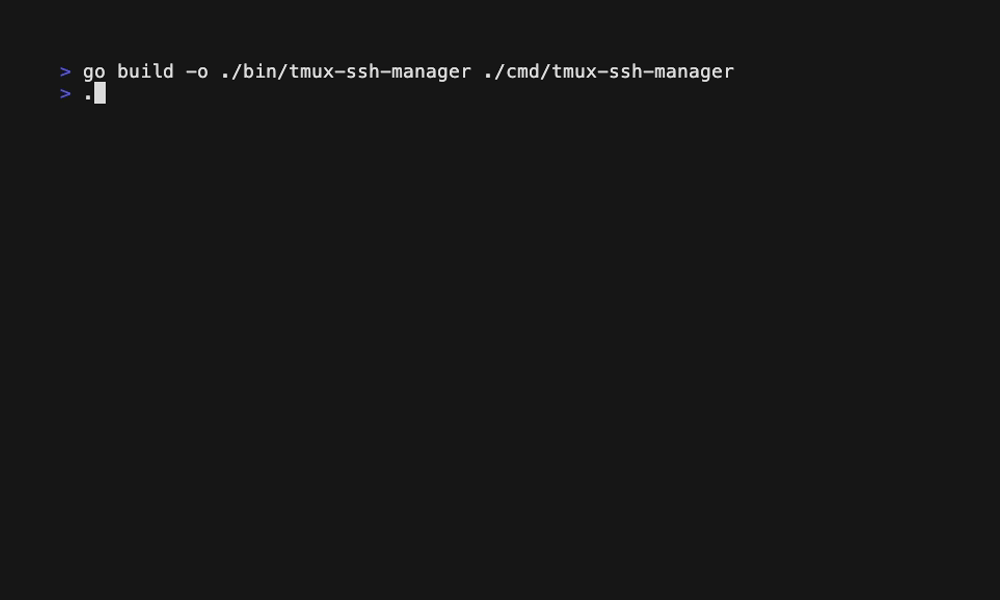
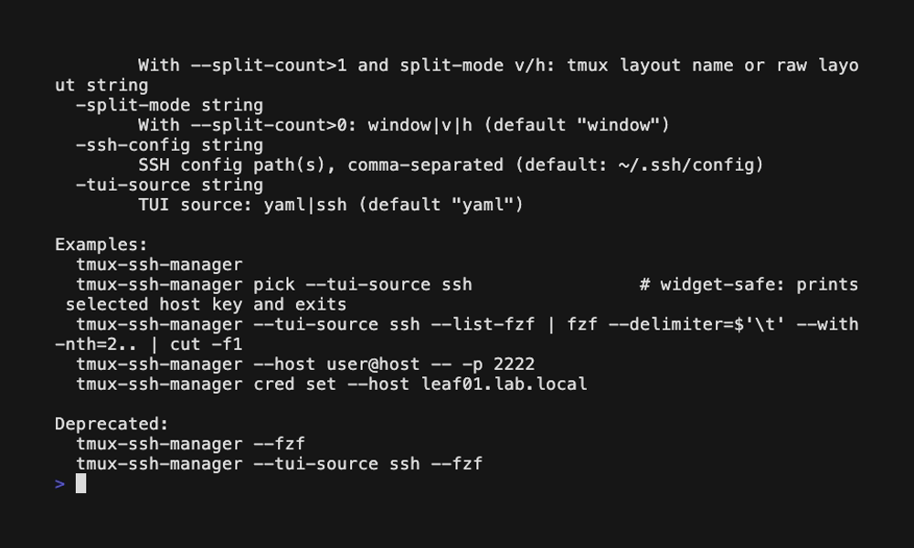

# Demos

This folder contains reproducible, scriptable terminal demos as **VHS tapes** (`*.tape`) and rendered **GIFs** (`*.gif`).

- Source (editable): `docs/demos/*.tape`
- Output (displayed): `docs/demos/*.gif`

## View on GitHub

GitHub renders GIFs inline, so the demos below should show up directly in the README.

### Rendered GIFs

#### Basic flow



#### Favorites filter



## Regenerate (VHS)

Prereqs (macOS):

- `vhs` (which in turn requires `ttyd` and `ffmpeg` available on your PATH)
- `go`
- `tmux` (recommended: render from inside tmux so window/pane behaviors match real usage)

Build the binary:

```sh
go build -o ./bin/tmux-ssh-manager ./cmd/tmux-ssh-manager
```

Render the demos (recommended to run from inside tmux):

```sh
brew install vhs

# Note: demos that open tmux windows/panes should be rendered from inside a tmux session.
vhs docs/demos/basic-flow.tape --output docs/demos/basic-flow.gif
vhs docs/demos/favorites-filter.tape --output docs/demos/favorites-filter.gif
```

## Notes / Troubleshooting

### GIF looks static (all frames identical)

This almost always means the tape isn’t performing any **visible** actions while recording (e.g., everything happens under `Hide`, or nothing happens after `Show`).

Fix by ensuring the tape:

- runs setup/build steps under `Hide` (optional),
- then switches to `Show`,
- and performs visible interactions (e.g., `Type`, navigation keys, `Enter`, plus `Sleep`/`Wait` between actions).

### Keep demos safe

- Use only demo config data (`docs/demos/hosts.demo.yaml`) and avoid recording secrets.
- Avoid recording real infrastructure identifiers if the repo is public.